# 区块链最终报告

16340296-张子权

Github：[https://github.com/zhangziquan/Smart-Market](https://github.com/zhangziquan/Smart-Market)

建议还是打开网站查看markdown格式的报告，转成pdf大小会很奇怪。。

## 选题背景

&emsp;&emsp;现在很多地方流行租赁，二手转卖，但是很难保证能够做到货真价实，常常会发生一些意外，比如一些明明是三四手的东西却标明是全新，二手，95成新等等。这些不对称信息使得买家会陷入劣势的境地。另外也有一些信用不好的买家，往往到手后挑刺砍价，简称“手刀”，既不点确认收货，也不退回货，让卖家陷入钱不到，货也没有的两难境地，只能接受砍价。

&emsp;&emsp;还有一些则是虚拟货品的发货，比如steam的key，某些激活码，优惠券，dota饰品，apple充值卡，点卡以及购物卡等等，虽然有rep声誉系统来给予判断信誉，但是难免会有一些恶意分子伪造造假，让一些新手被骗。

另外由于一些骗子的存在让很多人排斥个人交易，寻求第三方平台又往往会付出较多的手续费，并且流程非常的繁琐。所以需要一个双方都认可的，又可以相互信任的平台来进行交易。

## 选题依据

&emsp;&emsp;因此我们可以利用区块链来做一个二手平台，卖家将货品的信息上传到区块链中，之后这件物品的交易数据和走向都会被记录在区块链上，这样可以方便买家查询所要购买的东西的信息，为了防止卖家上传虚假信息，将会查询卖家之前所购买的二手商品，进行查重验证，避免信息不符。在交易完成之后，若发生到手后砍价等恶意行为，卖家可以进行评价，加入到个人信誉信息之中，这样能够提供给别的卖家进行谨慎的选择是否出售。
&emsp;&emsp;特别适用于一些虚拟货品之类的东西，可以直接部署智能合约自动执行转账发货等功能，当收到转账后自动执行发货，这就避免了恶意分子收钱不发货等，实现点对点交易，凭借不可篡改的技术得到真实信息，提高交易效率。另外因为信息发布到链上使得查询就变得非常方便，有利于买家能够进行挑选。
&emsp;&emsp;买家和卖家提供短时间内的密钥用于查询对方的交易历史是否正常。
&emsp;&emsp;在链上部署智能机器人能够进行回答各种问题，负责解决某些常见的问题回答。

## 使用说明

部署说明：

0. !!先使用npm install 安装所需要的依赖项!!
    ```shell
    npm install
    ```

1. 启动私链，rpc端口为8454，解锁账户  
  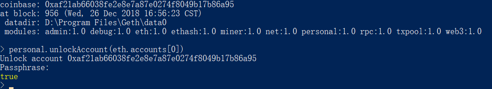

2. 安装truffle，进行智能合约的编译(因为使用了新特性，所以出现了warning)  
  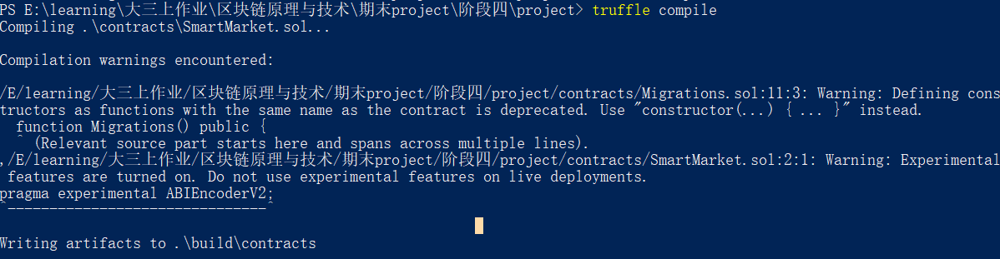

3. 编译完智能合约之后，进行智能合约的部署  
  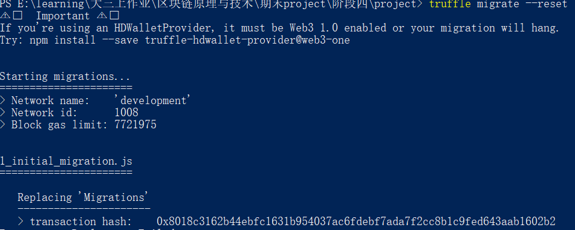

4. 进行挖矿，使部署完成  
  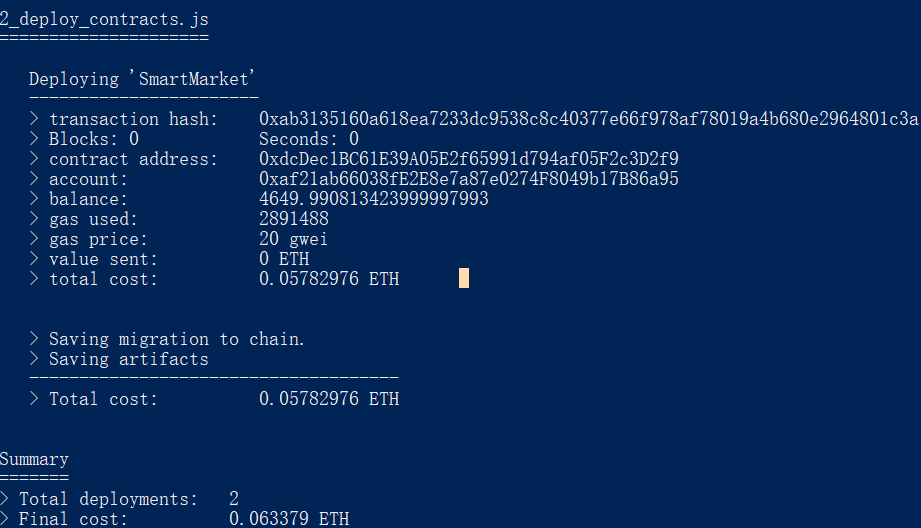

5. 然后就可以启动DAPP了，即区块链应用
  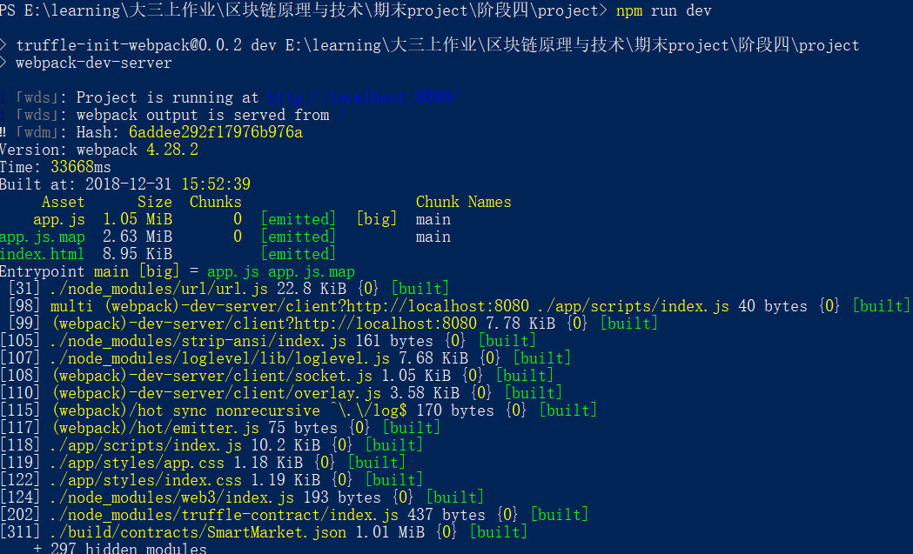

最终产品界面：


**用户界面：**


&emsp;&emsp;用户界面用于客户进行浏览，购物使用，可以查看商品的价格，状态，是否有人竞拍等等，方便客户进行浏览和选择。
| Input  |  Usage  |
|:------:|:-------:|
|Address |输入客户用于购买账户的地址|
|Password| 测试时可以不要，应用时需要解锁账户，因此需要密码，也可以另外解锁之后再使用。|
|No      |可以快速根据货物id进行查找，也可以在右边的下拉栏进行拉去查看。|
|Value   |输入您需要付出的价钱，因为这里有个拍卖系统以及一口价系统，当价钱超过一口价时自动获得。否则进入拍卖。所以要注意查看当前的商品价钱。当价钱不足时自动退回，但要扣除一些手续费。|

**管理界面：**
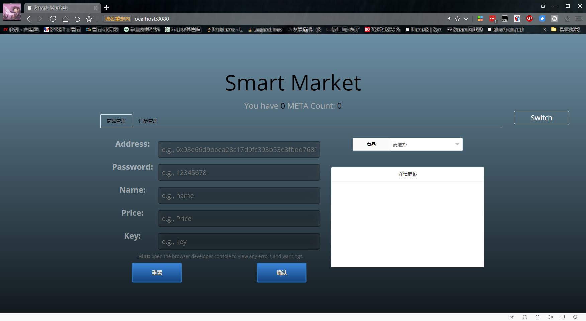
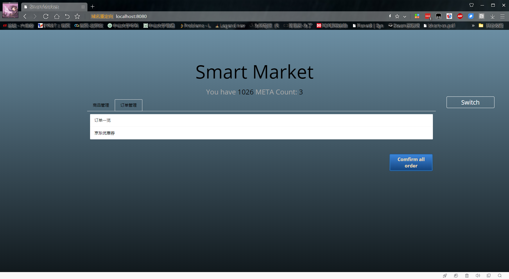

&emsp;&emsp;而管理界面则方便合约拥有者进行合约的管理，如管理商品，上架和下架，确认订单等等。查看各个货物的状态，当前价格，是否有人拍下等等。订单管理则是根据当前商品信息来获得，可以选择确认订单。

| Input  |  Usage  |
|:------:|:-------:|
|Address |输入管理者的创建合约的地址用于验证信息|
|Password|测试时可以不要，应用时需要解锁账户，因此需要密码，也可以另外解锁之后再使用。|
|Name    |输入上架货物的名称，可以自行定义，方面客户进行浏览确认|
|Price   |输入上架货物的价格，为了方便管理，当前输入的价格为竞拍低价，一口价为低价2|
|Key     |即输入货物的关键使用密钥，激活码等等，存储在合约内，仅当货物在完成或出货的时候，可以由客户取得|

&emsp;&emsp;右边的浏览则是浏览整个商品列表，可以方便进行所有商品的浏览查看。

## 测试

&emsp;&emsp;利用testrpc进行DAPP的测试，因为不需要解锁和挖矿，因此十分地方便。

客户端：

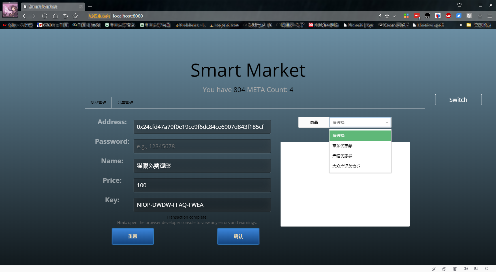

&emsp;&emsp;进行交易的创建,创建了几个商品，通过填写各种信息，点击创建按钮即可创建。

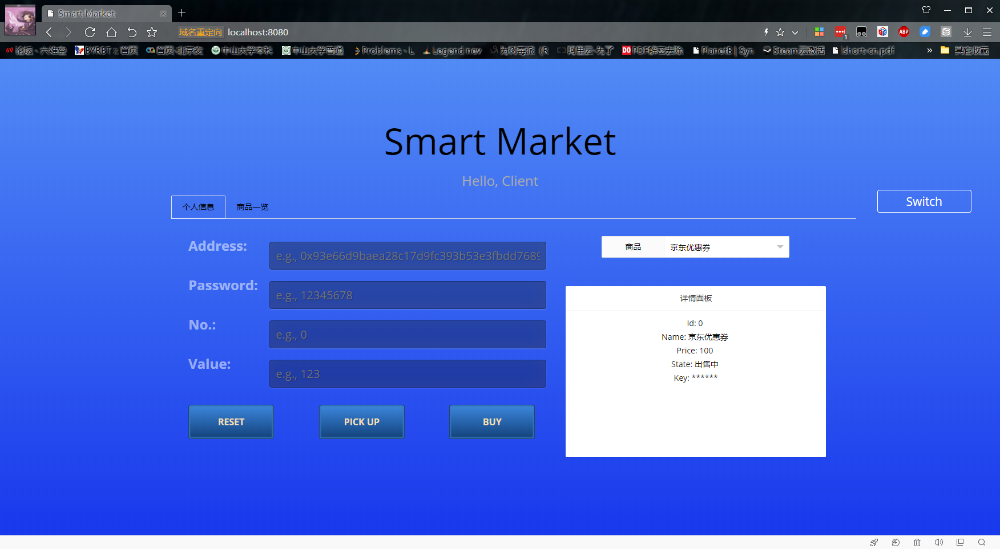

&emsp;&emsp;此时可以在客户端进行查看，通过下拉栏来查看全部货物的情况，可以显示id，名称，价格，以及当前的状态。


&emsp;&emsp;输入了客户的信息，解锁了账户之后，填入价格即可进行购买的操作，弹窗显示购买成功。

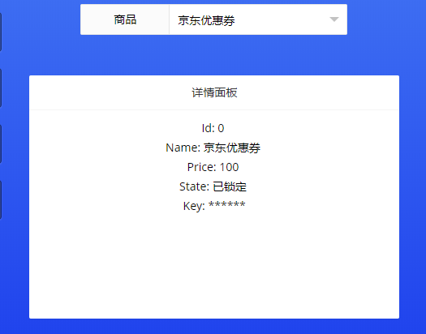

&emsp;&emsp;因为是一口价价格，所以状态变成已锁定，即该商品已被某个买家确定了，此时其他买家是不可以进行购买的。然后买家就可以等待卖家进行发货，即确认订单，待确认订单之后，即可取货。


&emsp;&emsp;卖家通过订单管理，查看筛选出所有被锁定的订单，然后即可进行确认的操作，也可以取消订单，但要付出一定的代价（想法是根据市场价波动来确定代价）。确定之后商品的状态则被改变。

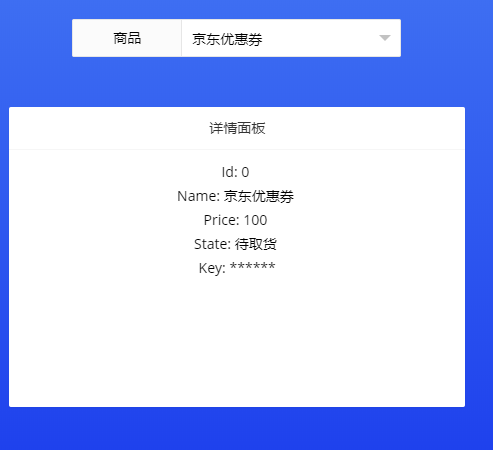

&emsp;&emsp;在客户端进行查看即可查看到刚刚购买的商品的状态从“已锁定”变为了“待取货”，提示客户已经可以取货了，这个时候就可以进行取货操作，输入刚刚用于购买的账户地址，点击pickup按钮。

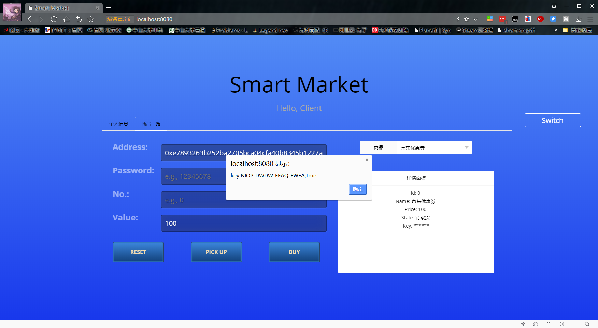

&emsp;&emsp;取货成功，获得key即虚拟商品的关键信息，即可进行使用，这个时候商品的状态则会变成“已完成”，其它买家同样也不能进行购买。这个会一直保持显示一段时间，之后从下拉栏中移除，若有需要还是可以通过No输入id来进行订单的查看，同样可以取得key。这是为了避免完成的订单妨碍到其它客户的浏览。


&emsp;&emsp;测试从未锁定的订单来进行取货，可以看到没有权限获得key。


&emsp;&emsp;测试从未确定的订单来进行取货，可以看到没有权限获得key。同样如果输入的地址不是当初用于转账的地址，同样也不能进行取货。

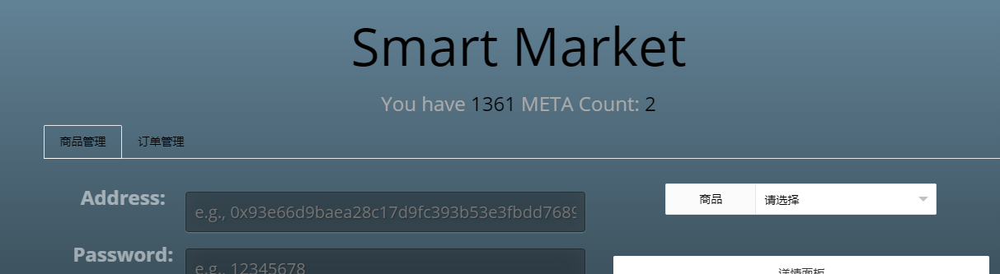

&emsp;&emsp;智能合约的拥有者可以在后台查看当前合约拥有的代代币，以及正在出售的商品，拥有者可以在客户评价之后取出已售出的商品的（押金+售出金额），未售出的就不能进行取出，同样若买家长时间为评价则取消其评价资格，默认好评。


&emsp;&emsp;进行页面的切换，显示正常。

## 待改进

&emsp;&emsp;还有很多地方尚待完善，比如评价系统，竞拍系统，以及客户主动取消订单的系统，已经划分好了tab选项卡，进行完善，之后的主页则会是登陆一样的界面，输入地址密码后自动锁定，后面的操作就不需要再次输入了。

&emsp;&emsp;机器人的查询等等可以使用JS来进行实现。。。比较来说Solidity真的是十分的蛋疼，而且还在不断更新，过了一个版本之后很多东西就变了。所以考虑使用JS做机器人的各种设置，再调用合约函数来实现。[https://www.ziquanzhang.ink/](https://www.ziquanzhang.ink/)根据之前的博客设计在看板娘的基础上加上点击等功能就差不多了。。。

## 实验心得

&emsp;&emsp;这次实验使用了layui的模板。。有点麻烦，因为这有很多动态生成的东西，改变了html之后又要重新渲染一遍，不然无法正确显示。特别是truffle的js有点奇怪，不知道怎么去手动添加一个js，只好把一些代码写到了html里，然后html里有layui和jquery的连接，通过这种方式来进行调用。这次实验还复习了一下javaScript和前端的设计。

&emsp;&emsp;有点不好的地方就是智能合约的调用函数的时候，如果发送交易的方式调用，返回的东西都接受不了，好像是要通过一个写在合约内的监视器来进行异步调用返回结果。但是我选择了每次调用之后用call调用来获取合约内的信息进行页面更新。